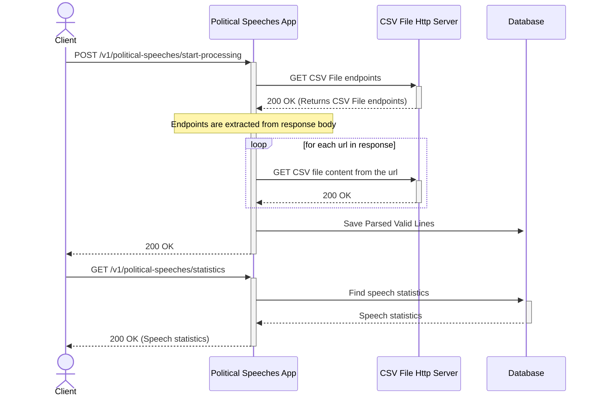

# Political Speech

The aim of this project is to process CSV File contents and respond for statistics about political speeches.

### Documentation

CSV files located on endpoints and these endpoints must be returned when value of the below config parameter is
requested.
`political.speech.csv.urls.endpoint`
You should configure this parameter before running the project.

CSV file (UTF-8 encoding) corresponding to the following schema:
`Speaker;Topic;Date;Words`

Each CSV file is processed and saved to database.
Invalid CSV line is not saved and skipped.
When requested for political speech statistics, the following questions are answered:

1. Which politician gave the most speeches in 2013?
2. Which politician gave the most speeches on "homeland security"?
3. Which politician spoke the fewest words overall?

The response body would be JSON format and its properties are shown below:

```json lines
{
  "mostSpeeches": string,
  "mostSecurity": string,
  "leastWordy": string
}
```

If there is no any data or no unique answer is possible for a question, this field is filled with `null`.
<br/>

The following sequence diagram shows how endpoints work:



Start the web application by running the main function of PoliticalSpeechApplication.kt,
and go to http://localhost:8080/h2-console/, you should see login page.
DB login credentials can be configured in application.properties.